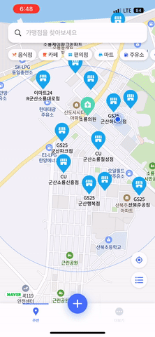
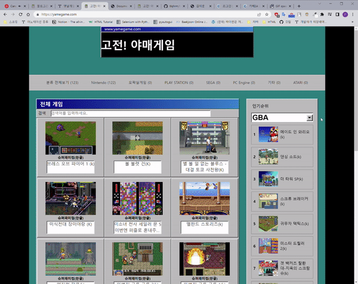

  

    대화가 시작되었습니다
  

  

    

      
안녕하세요. 자기소개 부탁드립니다.

    

  

  

    

      <h3>자기소개</h3>
 

      
      <!-- 기본 정보 카드 -->
      

        

          

            <svg width="20" height="20" viewBox="0 0 24 24" fill="none">
              <path d="M20 21v-2a4 4 0 0 0-4-4H8a4 4 0 0 0-4 4v2" stroke="currentColor" stroke-width="2" stroke-linecap="round" stroke-linejoin="round"/>
              <circle cx="12" cy="7" r="4" stroke="currentColor" stroke-width="2" stroke-linecap="round" stroke-linejoin="round"/>
            </svg>
          

          

            이름
            김지훈
          

        

        
        

          

            <svg width="20" height="20" viewBox="0 0 24 24" fill="none">
              <polyline points="16,18 22,12 16,6" stroke="currentColor" stroke-width="2" stroke-linecap="round" stroke-linejoin="round"/>
              <polyline points="8,6 2,12 8,18" stroke="currentColor" stroke-width="2" stroke-linecap="round" stroke-linejoin="round"/>
            </svg>
          

          

            직무
            백엔드 개발자
          

        

        
        

          

<svg xmlns="http://www.w3.org/2000/svg" width="24" height="24" viewBox="0 0 24 24" fill="none" stroke="currentColor" stroke-width="2" stroke-linecap="round" stroke-linejoin="round" class="lucide lucide-clock3-icon lucide-clock-3"><path d="M12 6v6h4"/><circle cx="12" cy="12" r="10"/></svg>          

          

            경력
            3년차
          

        

        
        

          

            <svg width="20" height="20" viewBox="0 0 24 24" fill="none">
              <rect x="2" y="4" width="20" height="16" rx="2" stroke="currentColor" stroke-width="2" stroke-linecap="round" stroke-linejoin="round"/>
              <polyline points="22,6 12,13 2,6" stroke="currentColor" stroke-width="2" stroke-linecap="round" stroke-linejoin="round"/>
            </svg>
          

          

            이메일
            wjstls123@gmail.com
          

        

        
        

          

            <svg width="20" height="20" viewBox="0 0 24 24" fill="none">
              <path d="M9 19c-5 1.5-5-2.5-7-3m14 6v-3.87a3.37 3.37 0 0 0-.94-2.61c3.14-.35 6.44-1.54 6.44-7A5.44 5.44 0 0 0 20 4.77 5.07 5.07 0 0 0 19.91 1S18.73.65 16 2.48a13.38 13.38 0 0 0-7 0C6.27.65 5.09 1 5.09 1A5.07 5.07 0 0 0 5 4.77a5.44 5.44 0 0 0-1.5 3.78c0 5.42 3.3 6.61 6.44 7A3.37 3.37 0 0 0 9 18.13V22" stroke="currentColor" stroke-width="2" stroke-linecap="round" stroke-linejoin="round"/>
            </svg>
          

          

            GitHub
            <a href="https://github.com/tlqhrm" target="_blank" style="color: inherit; text-decoration: none;">github.com/tlqhrm</a>
          

        

        
<!--
        

          

            <svg xmlns="http://www.w3.org/2000/svg" width="24" height="24" viewBox="0 0 24 24" fill="none" stroke="currentColor" stroke-width="2" stroke-linecap="round" stroke-linejoin="round" class="lucide lucide-rss-icon lucide-rss"><path d="M4 11a9 9 0 0 1 9 9"/><path d="M4 4a16 16 0 0 1 16 16"/><circle cx="5" cy="19" r="1"/></svg>
          

          

            블로그
            <a href="https://velog.io/@tlqhrm" target="_blank" style="color: inherit; text-decoration: none;">velog.io/@tlqhrm</a>
          

        

-->
        
        

          

            <svg xmlns="http://www.w3.org/2000/svg" width="20" height="20" viewBox="0 0 24 24" fill="none" stroke="currentColor" stroke-width="2" stroke-linecap="round" stroke-linejoin="round"><path d="M22 10v6M2 10l10-5 10 5-10 5z"/><path d="M6 12v5c3 3 9 3 12 0v-5"/></svg>
          

          

            학력
            강남대학교 부동산학과
            (2014.03 - 2020.08)
          

        

      

       
      
      <!-- 자기소개 텍스트 -->
      

        <h4 style="margin: 0 0 20px 0; color: #2980b9; font-size: 18px; font-weight: 600; letter-spacing: -0.3px;">안녕하세요!</h4>
        
스타트업에서 근무하며 다양한 서비스를 직접 경험해왔습니다. 백엔드 리드로서 항상 서비스의 기획 단계부터 참여해 인프라 구축, DB 설계, 비즈니스 로직 등 백엔드 전반을 책임졌습니다. 작은 조직의 특성상 하나의 역할에 머무르지 않고 서비스 전반을 직접 설계하고 운영하며 빠르게 성장할 수 있었습니다.

        
        <!-- 구분선 -->
        

        
        
새로운 일을 맡으면 부담보다는 배우고 해결할 기회라고 생각합니다. 모르는 영역이라도 스스로 공부해 구현하고, 필요하다면 주 업무가 아니어도 팀에 필요한 일이라면 참여합니다.

        
        
팀 안에서는 혼자 결정하기보다는 제 의견을 적극적으로 공유하고 다른 의견과 조율해 더 나은 방법을 찾으려고 합니다.

        
        
무엇보다 기획 의도를 제대로 파악하고, 사용자가 실제로 어떻게 쓰게 될지 생각하며 기능을 설계합니다. 기능 하나하나가 서비스 전체 흐름에 맞아야 한다고 생각합니다.

      

       
    

  

  

    

      
기술 스택에 대해 알려주세요.

    

  

  

    

      <h3>기술 스택</h3>
      
      <!-- 기술 스택 목록 -->
      

        
        

          

            

              <svg width="20" height="20" viewBox="0 0 24 24" fill="none">
                <polyline points="16,18 22,12 16,6" stroke="currentColor" stroke-width="2" stroke-linecap="round" stroke-linejoin="round"/>
                <polyline points="8,6 2,12 8,18" stroke="currentColor" stroke-width="2" stroke-linecap="round" stroke-linejoin="round"/>
              </svg>
            

            

              
백엔드

              

                
• Node.js (Nest.js)

                
• Golang (Gin)

              

            

          

          
          

            

              <svg width="20" height="20" viewBox="0 0 24 24" fill="none">
                <ellipse cx="12" cy="5" rx="9" ry="3" stroke="currentColor" stroke-width="2" stroke-linecap="round" stroke-linejoin="round"/>
                <path d="m3 5v14c0 1.66 4 3 9 3s9-1.34 9-3V5" stroke="currentColor" stroke-width="2" stroke-linecap="round" stroke-linejoin="round"/>
                <path d="m3 12c0 1.66 4 3 9 3s9-1.34 9-3" stroke="currentColor" stroke-width="2" stroke-linecap="round" stroke-linejoin="round"/>
              </svg>
            

            

              
데이터베이스

              

                
• MySQL

                
• PostgreSQL

                
• Redis

                
• Firestore

              

            

          

        

        
        

          

            

              <svg xmlns="http://www.w3.org/2000/svg" width="24" height="24" viewBox="0 0 24 24" fill="none" stroke="currentColor" stroke-width="2" stroke-linecap="round" stroke-linejoin="round" class="lucide lucide-container-icon lucide-container"><path d="M22 7.7c0-.6-.4-1.2-.8-1.5l-6.3-3.9a1.72 1.72 0 0 0-1.7 0l-10.3 6c-.5.2-.9.8-.9 1.4v6.6c0 .5.4 1.2.8 1.5l6.3 3.9a1.72 1.72 0 0 0 1.7 0l10.3-6c.5-.3.9-1 .9-1.5Z"/><path d="M10 21.9V14L2.1 9.1"/><path d="m10 14 11.9-6.9"/><path d="M14 19.8v-8.1"/><path d="M18 17.5V9.4"/></svg>
            

            

              
DevOps

              

                
• AWS

                
• Naver Cloud Platform

                
• Docker

                
• Kubernetes

                
• Apache Kafka

              

            

          

          
          

            

              <svg xmlns="http://www.w3.org/2000/svg" width="24" height="24" viewBox="0 0 24 24" fill="none" stroke="currentColor" stroke-width="2" stroke-linecap="round" stroke-linejoin="round" class="lucide lucide-book-open-icon lucide-book-open"><path d="M12 7v14"/><path d="M3 18a1 1 0 0 1-1-1V4a1 1 0 0 1 1-1h5a4 4 0 0 1 4 4 4 4 0 0 1 4-4h5a1 1 0 0 1 1 1v13a1 1 0 0 1-1 1h-6a3 3 0 0 0-3 3 3 3 0 0 0-3-3z"/></svg>
            

            

              
프론트엔드

              

                
• Vue.js (Nuxt.js)

              

            

          

        

      

    

  

  

    

      
어떤 경력이 있으신가요?

    

  

  

    

        <h3>경력</h3>
      <h4 class="company-name">에스지알소프트</h4>
      
      <!-- 경력 기본 정보 카드 -->
      

        

          

            <svg width="20" height="20" viewBox="0 0 24 24" fill="none">
              <circle cx="12" cy="12" r="10" stroke="currentColor" stroke-width="2" stroke-linecap="round" stroke-linejoin="round"/>
              <polyline points="12,6 12,12 16,14" stroke="currentColor" stroke-width="2" stroke-linecap="round" stroke-linejoin="round"/>
            </svg>
          

          

            근무 기간
            2022.12 ~ 2025.03
          

        

        

          

            <svg xmlns="http://www.w3.org/2000/svg" width="24" height="24" viewBox="0 0 24 24" fill="none" stroke="currentColor" stroke-width="2" stroke-linecap="round" stroke-linejoin="round" class="lucide lucide-building2-icon lucide-building-2"><path d="M6 22V4a2 2 0 0 1 2-2h8a2 2 0 0 1 2 2v18Z"/><path d="M6 12H4a2 2 0 0 0-2 2v6a2 2 0 0 0 2 2h2"/><path d="M18 9h2a2 2 0 0 1 2 2v9a2 2 0 0 1-2 2h-2"/><path d="M10 6h4"/><path d="M10 10h4"/><path d="M10 14h4"/><path d="M10 18h4"/></svg>
          

          

            회사 규모
            스타트업 (10명 내외)
시리즈 A

        
  <!--      
        

          

            <svg width="20" height="20" viewBox="0 0 24 24" fill="none">
              <path d="M20 7l-8-4-8 4m16 0l-8 4m8-4v10l-8 4m0-10L4 7m8 4v10" stroke="currentColor" stroke-width="2" stroke-linecap="round" stroke-linejoin="round"/>
            </svg>
          

          

            직책
            백엔드 개발자
          

        

-->
        
        

          

            <svg xmlns="http://www.w3.org/2000/svg" width="24" height="24" viewBox="0 0 24 24" fill="none" stroke="currentColor" stroke-width="2" stroke-linecap="round" stroke-linejoin="round" class="lucide lucide-receipt-text-icon lucide-receipt-text"><path d="M4 2v20l2-1 2 1 2-1 2 1 2-1 2 1 2-1 2 1V2l-2 1-2-1-2 1-2-1-2 1-2-1-2 1Z"/><path d="M14 8H8"/><path d="M16 12H8"/><path d="M13 16H8"/></svg>
          

          

            주요 업무
            네이버 클라우드 플랫폼 서비스
미디어 솔루션
          

        

      

      
      
      <!-- 주요 업무 경험 -->
 
      
      <!-- 네이버 클라우드 플랫폼 서비스 그룹 -->
      

        <h5 style="color: #000; margin-bottom: 16px; font-size: 17px; font-weight: 600;">네이버 클라우드 플랫폼 서비스</h5>
        
네이버 클라우드 플랫폼 서비스의 백엔드를 담당했습니다. 외부 부서와 지속적으로 협업하며 다양한 업무 프로세스를 경험했습니다. 

        
        <!-- Video Player Enhancement & Media Analytics 통합 카드 -->
        

          

            

              <svg xmlns="http://www.w3.org/2000/svg" width="20" height="20" viewBox="0 0 24 24" fill="none" stroke="currentColor" stroke-width="2" stroke-linecap="round" stroke-linejoin="round"><polygon points="23 7 16 12 23 17 23 7"/><rect width="14" height="14" x="1" y="5" rx="2" ry="2"/></svg>
            

            

              <h6 style="margin: 0; color: #2980b9; font-size: 17px; font-weight: 600;">Video Player Enhancement</h6>
              네이버 클라우드 비디오 플레이어 서비스 및 분석 시스템 (2023.04 - 2025.03)
            

          

          <ul style="margin: 0 0 12px 0; color: #777; font-size: 14px; line-height: 1.4;">
            <li>퍼블릭-프라이빗 서브넷 구조를 사용한 인프라 구축</li>
            <li>백엔드 담당자로 주간 회의에 참여하여 신규 기능 기획 및 유지보수 항목을 협의</li>
            <li>플레이어에서 사용자 시청 행동을 분석하는 시스템을 개발하고, 데이터를 조합하여 통계로 제공</li>
            <li>클라우드 서비스 운영을 위한 보안 컴플라이언스 적용 및 문서 작성</li>
            <li>쿠키 기반 세션 환경에서 Redis를 활용한 중복 로그인 불가 기능 구현</li>  
            <li>Email, OTP를 활용한 2차 인증 기능 구현 </li>
          </ul>
          

            #미디어 플레이어
            #클라우드 서비스
            #보안 컴플라이언스
            #커뮤니케이션
          

        

      

      
      <!-- 자사 미디어 플랫폼 그룹 -->
         
      

        <h5 style="color: #000; margin-bottom: 16px; font-size: 17px; font-weight: 600;">미디어 솔루션</h5>
        
네이버 클라우드의 미디어 서비스를 사용하여 다양한 미디어 솔루션을 개발했습니다.

        
        <!-- 비디오24 카드 -->
        

          

            

              <svg xmlns="http://www.w3.org/2000/svg" width="20" height="20" viewBox="0 0 24 24" fill="none" stroke="currentColor" stroke-width="2" stroke-linecap="round" stroke-linejoin="round"><rect width="20" height="14" x="2" y="3" rx="2"/><path d="M8 21h8"/><path d="M12 17v4"/><circle cx="12" cy="10" r="2"/></svg>
            

            

              <h6 style="margin: 0; color: #2980b9; font-size: 17px; font-weight: 600;">비디오24</h6>
              B2B Online Video Platform 솔루션 (2023.12 - 2025.03)
            

          

          <ul style="margin: 0 0 12px 0; color: #777; font-size: 14px; line-height: 1.4;">
            <li>라이브 스트리밍, VOD 업로드 시스템 유지보수</li>
            <li>관리자 CMS의 관리/조회/통계 API 개발</li>
          </ul>
          

            #Live/VOD 스트리밍
            #관리자 페이지
            #통계 기능
          

        

        
        <!-- 쇼츠24 카드 -->
        

          

            

              <svg xmlns="http://www.w3.org/2000/svg" width="20" height="20" viewBox="0 0 24 24" fill="none" stroke="currentColor" stroke-width="2" stroke-linecap="round" stroke-linejoin="round"><rect width="14" height="20" x="5" y="2" rx="2" ry="2"/><path d="M12 18h.01"/></svg>
            

            

              <h6 style="margin: 0; color: #2980b9; font-size: 17px; font-weight: 600;">쇼츠24</h6>
              쇼핑몰에서 사용하는 숏폼 솔루션 (2024.02 - 2025.03)
            

          

          <ul style="margin: 0 0 12px 0; color: #777; font-size: 14px; line-height: 1.4;">
            <li>카페24 API와 Webhook을 활용해 숏폼 콘텐츠와 상품 정보를 자동 연동 및 최신화</li>
            <li>사용량 기반의 계단식 과금 모델을 설계·적용하고, 자동 결제 및 실패 재시도 기능을 개발</li>
            <li>무료 체험기간과 크레딧 제공·차감·만료 기능을 개발하여 요금 체계에 연동</li>
            <li>영상 업로드 서버와 업로드 시 다양한 화질로 인코딩 되는 파이프라인 개발</li>
          </ul>
          

            #숏폼
            #과금 시스템
            #크레딧 관리
            #인코딩 파이프라인
          

        

        
        <!-- 라이브24 카드 -->
        

          

            

<svg xmlns="http://www.w3.org/2000/svg" width="24" height="24" viewBox="0 0 24 24" fill="none" stroke="currentColor" stroke-width="2" stroke-linecap="round" stroke-linejoin="round" class="lucide lucide-tv-icon lucide-tv"><path d="m17 2-5 5-5-5"/><rect width="20" height="15" x="2" y="7" rx="2"/></svg>            

            

              <h6 style="margin: 0; color: #2980b9; font-size: 17px; font-weight: 600;">라이브24</h6>
              쇼핑몰에서 사용하는 라이브 커머스 솔루션 (2022.12 - 2025.03)
            

          

          <ul style="margin: 0 0 12px 0; color: #777; font-size: 14px; line-height: 1.4;">
            <li>라이브 방송에 필요한 방송 전·후의 비즈니스 로직 유지보수</li>
            <li>방송 시작 시 브라우저 Web Push를 통한 유저 알림 기능 개발</li>
            <li>무한스크롤에 필요한 랜덤 플레이리스트 API 구현</li>
            <li>OpenAI API를 활용해 매출 정보, 채팅 내역 요약, 사용자 맞춤형 응답을 제공하는 대화형 챗봇 개발</li>
          </ul>
          

            #라이브 커머스
            #Web Push
            #챗봇
          

        

      

    

  

  

    

      
어떤 프로젝트들을 진행해보셨나요?

    

  

  

    

      <h3>프로젝트</h3>
      
      <!-- TapPlace 프로젝트 카드 -->
      

        

          

            

              

<svg xmlns="http://www.w3.org/2000/svg" width="24" height="24" viewBox="0 0 24 24" fill="none" stroke="currentColor" stroke-width="2" stroke-linecap="round" stroke-linejoin="round" class="lucide lucide-map-icon lucide-map"><path d="M14.106 5.553a2 2 0 0 0 1.788 0l3.659-1.83A1 1 0 0 1 21 4.619v12.764a1 1 0 0 1-.553.894l-4.553 2.277a2 2 0 0 1-1.788 0l-4.212-2.106a2 2 0 0 0-1.788 0l-3.659 1.83A1 1 0 0 1 3 19.381V6.618a1 1 0 0 1 .553-.894l4.553-2.277a2 2 0 0 1 1.788 0z"/><path d="M15 5.764v15"/><path d="M9 3.236v15"/></svg>              

              

                <h6 style="margin: 0; color: #2980b9; font-size: 17px; font-weight: 600;">TapPlace</h6>
                간편결제 매장 찾기 서비스 (2022.06 - 2022.11)
              

            

            
ApplePay 국내 정식 도입 전, 미리 ApplePay와 다른 간편결제 사용 가능한 매장을 보여주는 서비스입니다.

            <ul style="margin: 0 0 12px 0; color: #777; font-size: 14px; line-height: 1.4;">
              <li>5인 팀 프로젝트에서 백엔드 전반 단독 개발</li>
              <li>Nest.js와 TypeORM을 사용한 백엔드 API 서버 구축</li>
              <li>프랜차이즈 웹사이트 크롤링을 통한 매장 데이터 수집 시스템 구축</li>
              <li>MySQL 공간 인덱스를 활용한 위치 기반 매장 검색 API 개발</li>
              <li>웹 페이지와 앱스토어 출시 및 서비스 운영</li>
            </ul>
            

                            #팀 프로젝트

              #웹 크롤링
              #공간 인덱스
              #위치 기반 서비스
            

            

              <a href="https://github.com/TapPlace" target="_blank" style="color: #2980b9; text-decoration: none; font-size: 13px;">
                <svg width="16" height="16" viewBox="0 0 24 24" fill="none" style="vertical-align: middle; margin-right: 4px;">
                  <path d="M9 19c-5 1.5-5-2.5-7-3m14 6v-3.87a3.37 3.37 0 0 0-.94-2.61c3.14-.35 6.44-1.54 6.44-7A5.44 5.44 0 0 0 20 4.77 5.07 5.07 0 0 0 19.91 1S18.73.65 16 2.48a13.38 13.38 0 0 0-7 0C6.27.65 5.09 1 5.09 1A5.07 5.07 0 0 0 5 4.77a5.44 5.44 0 0 0-1.5 3.78c0 5.42 3.3 6.61 6.44 7A3.37 3.37 0 0 0 9 18.13V22" stroke="currentColor" stroke-width="2" stroke-linecap="round" stroke-linejoin="round"/>
                </svg>
                GitHub 저장소
              </a>
            

          

          

            

              <!-- 이미지 갤러리 컨테이너 -->
              

                
                
                
              

              <!-- 이미지가 여러 개일 때 표시되는 네비게이션 버튼들 -->
              

                <button class="gallery-btn prev-btn" type="button">
                  <svg width="20" height="20" viewBox="0 0 24 24" fill="none" stroke="currentColor" stroke-width="2">
                    <polyline points="15,18 9,12 15,6"></polyline>
                  </svg>
                </button>
                <button class="gallery-btn next-btn" type="button">
                  <svg width="20" height="20" viewBox="0 0 24 24" fill="none" stroke="currentColor" stroke-width="2">
                    <polyline points="9,18 15,12 9,6"></polyline>
                  </svg>
                </button>
              

              <!-- 이미지 인디케이터 -->
              

                
              

            

          

        

      

      
      <!-- 야매게임 프로젝트 카드 -->
      

        

          

            

              

<svg xmlns="http://www.w3.org/2000/svg" width="24" height="24" viewBox="0 0 24 24" fill="none" stroke="currentColor" stroke-width="2" stroke-linecap="round" stroke-linejoin="round" class="lucide lucide-gamepad2-icon lucide-gamepad-2"><line x1="6" x2="10" y1="11" y2="11"/><line x1="8" x2="8" y1="9" y2="13"/><line x1="15" x2="15.01" y1="12" y2="12"/><line x1="18" x2="18.01" y1="10" y2="10"/><path d="M17.32 5H6.68a4 4 0 0 0-3.978 3.59c-.006.052-.01.101-.017.152C2.604 9.416 2 14.456 2 16a3 3 0 0 0 3 3c1 0 1.5-.5 2-1l1.414-1.414A2 2 0 0 1 9.828 16h4.344a2 2 0 0 1 1.414.586L17 18c.5.5 1 1 2 1a3 3 0 0 0 3-3c0-1.545-.604-6.584-.685-7.258-.007-.05-.011-.1-.017-.151A4 4 0 0 0 17.32 5z"/></svg>              

              

                <h6 style="margin: 0; color: #2980b9; font-size: 17px; font-weight: 600;">야매게임</h6>
                고전 콘솔게임 웹 에뮬레이터 / 개인 프로젝트 (2022.05 - 2022.06)
              

            

            
EmulatorJs를 이용해 웹에서 고전 콘솔게임을 실행시키고 세이브 파일을 서버에 저장하고, 불러올 수 있습니다.

            <ul style="margin: 0 0 12px 0; color: #777; font-size: 14px; line-height: 1.4;">
              <li>Google OAuth2.0을 이용한 소셜 로그인 구현</li>
              <li>사용자별 게임 진행 상황 서버 저장/불러오기 기능</li>
              <li>HTML, CSS, JS로 윈도우 95 테마 적용</li>
              <li>Vue.js를 이용한 인기 순위 시스템 구현</li>
              <li>Express.js 기반 HTTP API 서버 구축</li>
            </ul>
            

              #개인 프로젝트
#고전게임

              #EmulatorJs
              #OAuth2.0

            

          

          

            

              <!-- 이미지 갤러리 컨테이너 -->
              

                
              

              <!-- 이미지가 여러 개일 때 표시되는 네비게이션 버튼들 -->
              

                <button class="gallery-btn prev-btn" type="button">
                  <svg width="20" height="20" viewBox="0 0 24 24" fill="none" stroke="currentColor" stroke-width="2">
                    <polyline points="15,18 9,12 15,6"></polyline>
                  </svg>
                </button>
                <button class="gallery-btn next-btn" type="button">
                  <svg width="20" height="20" viewBox="0 0 24 24" fill="none" stroke="currentColor" stroke-width="2">
                    <polyline points="9,18 15,12 9,6"></polyline>
                  </svg>
                </button>
              

              <!-- 이미지 인디케이터 -->
              

                
              

            

          

        

      

    

  

  

    

      
어떤 자격증을 보유하고 계신가요?

    

  

  

    

      <h3>자격증</h3>
      
      <!-- DevOps 자격증 그룹 -->
      

        <h5 style="color: #000; margin-bottom: 16px; font-size: 17px; font-weight: 600;">DevOps</h5>
        
        <!-- CKA 카드 -->
        

          

            <h6 style="margin: 0; color: #2980b9; font-size: 17px; font-weight: 600;">Certified Kubernetes Administrator (CKA)</h6>
            취득일: 2025.06
          

          

            #Kubernetes
            #컨테이너 오케스트레이션
            #클러스터 관리
          

        

        
        <!-- AWS SAA 카드 -->
        

          

            <h6 style="margin: 0; color: #2980b9; font-size: 17px; font-weight: 600;">AWS Certified Solutions Architect (SAA)</h6>
            취득일: 2025.05
          

          

            #AWS
            #솔루션 아키텍처
            #클라우드 설계
          

        

      

      
      <!-- 국내 자격증 그룹 -->
      

        <h5 style="color: #000; margin-bottom: 16px; font-size: 17px; font-weight: 600;">국내 자격증</h5>
        
        <!-- 정보처리기사 카드 -->
        

          

            <h6 style="margin: 0; color: #2980b9; font-size: 17px; font-weight: 600;">정보처리기사</h6>
            취득일: 2022.06
          

          

            #국가기술자격
          

        

        
        <!-- 컴퓨터활용능력 1급 카드 -->
        

          

            <h6 style="margin: 0; color: #2980b9; font-size: 17px; font-weight: 600;">컴퓨터활용능력 1급</h6>
            취득일: 2020.12
          

         
        

      

      
    

  

  

    감사합니다. 좋은 하루 되세요 😊
  

